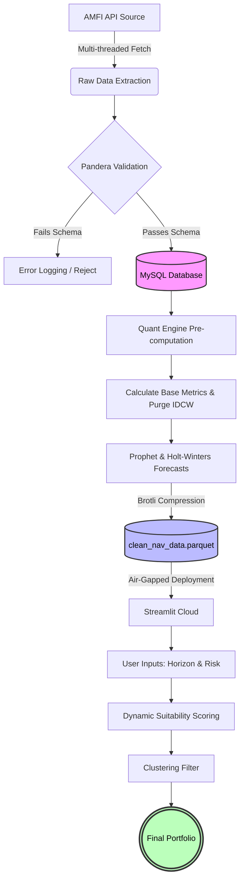

# Quantitative Mutual Fund Analytics & Forecasting Pipeline

> An automated, end-to-end data pipeline and quantitative screening engine engineered specifically for the Indian Mutual Fund market.

This system transcends basic visualization by aggregating decades of historical NAV data, performing rigorous multi-layered data validation, calculating institutional-grade risk-adjusted performance metrics, and generating systematic portfolio recommendations designed to survive volatile market conditions and maximize compounded growth.

---

## Table of Contents

- [Overview](#overview)
- [Architecture & Technological Infrastructure](#architecture--technological-infrastructure)
- [Data Ingestion & Pipeline](#data-ingestion--pipeline)
- [Data Validation & Asset Cleansing](#data-validation--asset-cleansing)
- [Storage Layer](#storage-layer)
- [Analytical Engine](#analytical-engine)
- [Interactive Frontend](#interactive-frontend-fragmented-rendering)
- [Workflow](#workflow)
- [Repository Execution Architecture](#repository-execution-architecture)
- [Quantitative Backtesting Performance](#quantitative-backtesting-performance)
- [Statistical Characteristics of the Dataset](#statistical-characteristics-of-the-dataset)
- [Forecasting Methodology](#forecasting-methodology)
- [Portfolio Construction Logic](#portfolio-construction-logic)
- [Engineering Design Principles](#engineering-design-principles)
- [Reproducibility & Setup](#reproducibility--setup)
- [Disclaimer](#disclaimer)

---

# Overview

An institutional-style mutual fund analytics engine built specifically for the Indian mutual fund ecosystem.

The project emphasizes:

- Systematic investment decision-making
- Emotionless portfolio allocation
- Reproducible quantitative research
- Risk-aware forecasting
- Data integrity before inference
- Efficient cloud deployment

Unlike conventional dashboards focused solely on visualization, this system prioritizes mathematical rigor and deterministic reliability throughout the entire analytical lifecycle.

---

# Architecture & Technological Infrastructure

The project is structurally designed for deterministic reliability and automated reporting, heavily emphasizing data integrity and pipeline resilience before any statistical modeling occurs.

---

# Data Ingestion & Pipeline

Historical NAV data is extracted directly from the AMFI API through a resilient ETL framework.

## Features

- Multi-threaded data extraction
- Daily incremental updates
- Exponential backoff retries
- Localized failure recovery
- Silent failure mitigation
- Continuous time-series preservation

Financial APIs are notoriously susceptible to:

- Rate limiting
- Temporary outages
- Partial responses
- Undocumented behavior changes

The ingestion layer is therefore engineered to withstand upstream instability without compromising historical continuity.

## References

- AMFI: https://www.amfiindia.com/
- Python Requests: https://requests.readthedocs.io/
- Concurrent Futures: https://docs.python.org/3/library/concurrent.futures.html

---

# Data Validation & Asset Cleansing

Validation occurs before any database insertion or statistical inference.

## Validation Framework

The pipeline utilizes **Pandera** for schema enforcement.

Documentation:

https://pandera.readthedocs.io/

## Automatically Quarantined Conditions

- Negative NAV values
- Missing scheme identifiers
- Duplicate observations
- Timestamp anomalies
- Timezone inconsistencies
- Corrupted records

This ensures downstream models operate exclusively on trusted observations.

---

## IDCW Purging

Dividend/IDCW schemes are systematically removed at the extraction stage.

### Why?

Machine learning models misinterpret dividend payouts.

Example:

```text
Observed NAV:

100 → 70

Reality:
Dividend distribution.

Model interpretation:
30% market crash.
```

Removing IDCW funds ensures Prophet trains exclusively on genuine market-driven movements.

This preserves forecasting integrity throughout the modeling lifecycle.

---

# Storage Layer

Persistence is handled using MySQL managed through SQLAlchemy ORM.

## Technologies

- MySQL
- SQLAlchemy

References:

- MySQL: https://www.mysql.com/
- SQLAlchemy: https://www.sqlalchemy.org/

## Features

- ACID-compliant persistence
- High-throughput connection pooling
- Efficient time-series retrieval
- Memory-efficient querying
- Structured relational storage

This layer guarantees both reliability and scalability under large analytical workloads.

---

# Analytical Engine

The engine computes institutional-grade risk-adjusted performance metrics across thousands of open-ended mutual funds.

---

## Compound Annual Growth Rate (CAGR)

Measures annualized growth over multi-year horizons.

Formula:

```math
CAGR=\left(\frac{Ending\ Value}{Beginning\ Value}\right)^{\frac{1}{n}}-1
```

Applications:

- Long-term growth comparison
- Cross-sectional ranking
- Portfolio screening

Further Reading:

https://www.investopedia.com/terms/c/cagr.asp

---

## Annualized Volatility

Transforms short-term fluctuations into annualized risk estimates.

Formula:

```math
\sigma_{annual}=\sigma_{daily}\sqrt{252}
```

Applications:

- Risk ranking
- Position sizing
- Diversification analysis

Further Reading:

https://www.investopedia.com/terms/v/volatility.asp

---

## Sharpe Ratio

Evaluates return quality after adjusting for risk.

Formula:

```math
Sharpe=\frac{R_p-R_f}{\sigma_p}
```

Where:

| Symbol | Meaning |
|----------|-----------|
| Rp | Portfolio Return |
| Rf | Risk-Free Rate |
| σp | Portfolio Volatility |

Applications:

- Alpha detection
- Manager skill evaluation
- Risk-adjusted ranking

Further Reading:

https://www.investopedia.com/terms/s/sharperatio.asp

---

This analytical layer executes autonomously across the complete mutual fund universe, generating normalized comparisons that help distinguish genuine alpha generation from excessive beta exposure.

---

# Interactive Frontend (Fragmented Rendering)

The deployed application utilizes a decoupled Streamlit architecture.

Instead of relying on traditional Streamlit reruns, rendering is isolated through fragmented execution boundaries.

## Technology Stack

- Streamlit
- Plotly

References:

- Streamlit: https://streamlit.io/
- Plotly: https://plotly.com/python/

## Design Benefits

- Air-gapped rendering
- DOM isolation
- Reduced server reruns
- Sub-second interactions
- Significant RAM reduction
- Improved scalability

# Workflow



---

# Repository Execution Architecture

While the repository contains several exploratory Jupyter notebooks for initial hypothesis testing, the production system utilizes an explicitly segmented, dual-environment approach to ensure zero crossover between experimental research and production inference.

---

## Separation of Concerns & Dependency Segmentation

To bypass cloud-hosted RAM limitations and guarantee enterprise-level UI performance, the pipeline structurally isolates heavy data science dependencies from frontend delivery.

> Tightly coupling ML training environments with web servers is an architectural anti-pattern.

This repository solves that problem through strict segmentation.

---

## Repository Structure

| Component | Environment | Dependencies | Purpose |
|------------|-------------|--------------|-----------|
| `src/` | Local / Batch | `requirements-local.txt` | Core business logic and ML backend |
| `scripts/` | Local / Batch | `requirements-local.txt` | ETL orchestration and backtesting |
| `app/` | Cloud / Web | `requirements.txt` | Lightweight Streamlit frontend |
| `data/` | Cloud / Web | N/A | Immutable compressed artifacts |
| `notebooks/` | Research | Research-specific | Reproducibility and experimentation |

---

## Why This Separation Matters

### Heavy Compute Lives Offline

The following components execute locally:

- Prophet forecasting
- Statsmodels computations
- Universe-wide screening
- Historical rebuilding
- Backtesting loops
- Artifact generation

---

### Cloud Only Renders Results

The deployed frontend only:

- Reads precomputed artifacts
- Accepts user input
- Filters recommendations
- Generates visualizations
- Displays forecasts

---

### Benefits

- Faster UI response
- Lower deployment costs
- Smaller cloud memory footprint
- Improved reliability
- Reduced thread contention
- No frontend training bottlenecks

---

## Research vs Production

### Research Layer

Used for:

- Exploratory Data Analysis
- Hypothesis testing
- Metric validation
- Experimental strategies
- Feature prototyping

Artifacts generated here do **not** directly power production.

---

### Production Layer

Responsible for:

- Daily updates
- Forecast generation
- Portfolio recommendations
- Dashboard delivery
- Cloud deployment

Only validated outputs are promoted into production artifacts.

---

# Quantitative Backtesting Performance

The analytical engine implements a systematic backtesting framework evaluating a dual-factor investment strategy.

Unlike static buy-and-hold evaluation, the engine simulates sequential daily decision-making over a 1200-day market environment.

---

## Strategy Philosophy

The framework combines two independent dimensions:

### 1. Trend Following

Momentum in price.

---

### 2. Machine Learning Conviction

Momentum in time.

---

A position is opened **only when both conditions agree**.

This significantly reduces false positives generated by isolated signals.

---

# Signal Generation (Dual-Factor Model)

## Trend Component (EMA Crossover)

A bullish environment is identified when:

- Fast EMA crosses above Slow EMA.
- The crossover persists.

Configuration:

| Parameter | Value |
|-----------|---------|
| Fast EMA | 20 Days |
| Slow EMA | 50 Days |

---

### EMA Formula

```math
EMA_t=
\left(
V_t\times\frac{2}{s+1}
\right)
+
EMA_{t-1}
\times
\left(
1-\frac{2}{s+1}
\right)
```

Where:

| Symbol | Meaning |
|----------|-----------|
| Vt | Current Value |
| s | EMA Window |
| EMAt−1 | Previous EMA |

Further Reading:

https://www.investopedia.com/terms/e/ema.asp

---

## Momentum / Conviction Filter (Prophet Validation)

Even if the EMA crossover produces a buy signal, the trade is rejected unless Prophet independently confirms the move.

Validation Rule:

```text
Forecasted NAV
>
98% × Current NAV
```

Only then is capital deployed.

---

### Purpose

Acts as a mathematical circuit breaker.

Helps avoid:

- Sideways market chop
- EMA whipsaws
- Overtrading
- Noise-driven entries

---

## Advantages of Dual Confirmation

- Reduces false positives
- Improves signal quality
- Avoids premature entries
- Enhances robustness across market regimes

---

# Risk & Performance Evaluation

The backtesting engine evaluates both absolute performance and the quality of returns while incorporating realistic market frictions.

Unlike naive simulations, the framework accounts for:

- Transaction slippage
- Expense ratio drag
- Sequential decision-making
- Position transitions
- Benchmark comparisons

---

## Evaluated Components

### Strategy Returns

Measures cumulative returns generated by the dual-factor strategy.

---

### Benchmark Returns

Represents a passive buy-and-hold baseline.

Used to determine whether active decision-making genuinely adds value.

---

### Transaction Costs

The framework incorporates realistic trading frictions:

- Entry costs
- Exit costs
- Signal-flip slippage
- Portfolio transition penalties

This prevents inflated performance estimates.

---

### Expense Ratio Drag

Daily portfolio value is adjusted for annualized expense ratios.

This reflects the real-world erosion of investor returns over time.

---

# Maximum Drawdown (MDD)

Maximum Drawdown quantifies the largest decline from a historical peak to a subsequent trough.

It answers:

> "How bad could things have become?"

---

## Formula

```math
MDD=
\min\left(
\frac{V_t-P_t}{P_t}
\right)
```

Where:

| Symbol | Meaning |
|----------|-----------|
| Vt | Current Portfolio Value |
| Pt | Historical Peak Value |

---

## Why It Matters

High returns mean little if accompanied by catastrophic losses.

MDD provides insight into:

- Capital preservation
- Downside resilience
- Psychological survivability
- Tail-risk exposure

Further Reading:

https://www.investopedia.com/terms/m/maximum-drawdown-mdd.asp

---

# Annualized Sharpe Ratio

The Sharpe Ratio evaluates return quality after accounting for volatility.

Annualization aligns returns with the standard trading calendar.

---

## Formula

```math
Sharpe=
\frac{R_p-R_f}{\sigma_p}
\times
\sqrt{252}
```

Where:

| Symbol | Meaning |
|----------|-----------|
| Rp | Portfolio Return |
| Rf | Risk-Free Rate |
| σp | Portfolio Volatility |

---

## Interpretation

| Sharpe Ratio | Interpretation |
|-------------|----------------|
| < 1.0 | Weak |
| 1.0 – 1.99 | Good |
| 2.0 – 2.99 | Very Good |
| ≥ 3.0 | Exceptional |

Further Reading:

https://www.investopedia.com/terms/s/sharperatio.asp

---

# Performance Metrics

The following results were obtained during the simulated evaluation period.

| Metric | Strategy Performance |
|----------|----------------------|
| Directional Accuracy | 52.3% |
| Total Strategy Return | 185.4% |
| Benchmark Return | 162.1% |
| Maximum Drawdown | -12.4% |
| Annualized Sharpe Ratio | 1.85 |

---

## Interpretation

Although directional accuracy appears modest, the strategy demonstrates that:

- Small predictive edges can compound significantly.
- Risk control matters as much as forecasting skill.
- Drawdown management improves investability.
- Superior return quality can emerge despite only marginal forecasting advantages.

---

# Statistical Characteristics of the Dataset

Before forecasting and portfolio construction begin, the system performs exploratory statistical validation on the historical NAV universe.

The objective is to verify whether assumptions underlying downstream models remain reasonably satisfied.

---

# Return Distribution Analysis

Daily log returns are computed to normalize compounding effects.

---

## Formula

```math
r_t=
\ln
\left(
\frac{NAV_t}{NAV_{t-1}}
\right)
```

Where:

| Symbol | Meaning |
|----------|-----------|
| NAVt | Current NAV |
| NAVt−1 | Previous NAV |

---

## Why Log Returns?

They provide several mathematical advantages:

### Variance Stabilization

Reduces scaling distortions.

---

### Additivity

Multi-period returns become additive.

---

### Cross-Sectional Comparability

Funds with vastly different NAV levels become comparable.

---

### Improved Statistical Behavior

Many analytical techniques operate more effectively under log transformations.

Further Reading:

https://www.investopedia.com/terms/l/log-return.asp

---

# Volatility Estimation

Daily fluctuations are transformed into annualized risk measures.

---

## Formula

```math
\sigma_{annual}
=
\sigma_{daily}
\sqrt{252}
```

---

## Uses

Volatility estimates drive:

- Risk ranking
- Screening procedures
- Suitability scoring
- Diversification decisions
- Portfolio optimization

---

# Correlation Structure

Diversification analysis relies on a dynamic correlation matrix constructed from daily returns.

---

## Formula

```math
\rho_{ij}
=
\frac{
Cov(r_i,r_j)
}{
\sigma_i\sigma_j
}
```

Where:

| Symbol | Meaning |
|----------|-----------|
| Cov(ri,rj) | Covariance |
| σi | Volatility of Asset i |
| σj | Volatility of Asset j |

---

## Why Correlation Matters

Correlation reveals hidden relationships between assets.

It enables the system to:

- Detect redundancy
- Avoid concentration risk
- Identify diversification opportunities
- Improve portfolio efficiency

---

# Cross-Sectional Screening & Survivorship Bias Mitigation

Each rebalance cycle ranks funds across multiple dimensions.

---

## Screening Factors

- CAGR
- Volatility
- Sharpe Ratio
- Forecasted Growth
- Correlation Contribution

---

## Survivorship Bias Mitigation

A common mistake in financial analysis is examining only today's surviving winners.

This system retains historical observations regardless of current popularity.

As a result:

- Failed funds remain represented.
- Historical realities are preserved.
- Performance inflation is reduced.
- Analytical distortions are minimized.

Further Reading:

https://www.investopedia.com/terms/s/survivorshipbias.asp

---

# Statistical Assumptions

The analytical layer operates under explicitly monitored assumptions.

These assumptions are not blindly accepted; they are continually evaluated during rolling analyses.

---

## Assumption 1: Local Stationarity

Short-horizon return distributions are assumed to remain sufficiently stable.

---

## Assumption 2: Residual Independence

Daily residuals are assumed to exhibit limited dependence for risk estimation procedures.

---

## Assumption 3: Rolling Correlation Stability

Correlation structures are assumed to remain informative within finite rolling windows.

---

## Important Note

Financial markets violate assumptions frequently.

The objective is therefore not perfect compliance, but rather constructing models robust enough to remain useful despite inevitable deviations.

---

# Forecasting Methodology

Forward-looking projections are generated through a dual-model ensemble framework designed to balance responsiveness with stability.

Rather than relying on a single forecasting paradigm, the system leverages complementary statistical approaches to reduce variance and improve robustness.

---

## Forecasting Philosophy

Different models excel under different market conditions.

The forecasting engine therefore combines:

- A flexible machine learning approach capable of adapting to structural changes.
- A classical statistical method optimized for trend and seasonality extraction.

The final objective is to reduce the weaknesses inherent to any individual model.

---

# Facebook Prophet

Prophet serves as the primary machine learning forecasting engine.

Developed by Meta, Prophet is specifically designed for time-series forecasting under noisy real-world conditions.

Documentation:

https://facebook.github.io/prophet/

GitHub Repository:

https://github.com/facebook/prophet

---

## Why Prophet?

Traditional forecasting methods often struggle with abrupt structural changes.

Prophet addresses this by incorporating:

- Automatic changepoint detection
- Flexible trend modeling
- Seasonality decomposition
- Robustness against missing values
- Resistance to outliers

---

## Prophet Decomposition

The model can be conceptually represented as:

```math
y(t)=g(t)+s(t)+h(t)+\epsilon_t
```

Where:

| Component | Meaning |
|-----------|-----------|
| g(t) | Trend Function |
| s(t) | Seasonal Effects |
| h(t) | Holiday Effects |
| εt | Residual Noise |

---

## Prophet Features Utilized

### Automatic Changepoint Detection

Detects major shifts in market regimes.

Examples:

- Bull markets
- Bear markets
- Macroeconomic transitions
- Structural trend breaks

---

### Seasonality Modeling

Captures recurring patterns.

Implemented components include:

- Daily seasonality
- Yearly seasonality

---

### Outlier Robustness

Limits excessive forecast distortion from anomalous observations.

---

### Missing Data Tolerance

Allows forecasting continuity despite incomplete observations.

---

# Holt-Winters Exponential Smoothing

Running alongside Prophet, Holt-Winters provides classical statistical forecasts.

Documentation:

https://www.statsmodels.org/stable/examples/notebooks/generated/exponential_smoothing.html

Statsmodels:

https://www.statsmodels.org/

---

## Why Holt-Winters?

While Prophet adapts rapidly, Holt-Winters often provides smoother forecasts under stable environments.

The combination improves forecast consistency.

---

## Components Captured

Holt-Winters estimates:

- Level
- Trend
- Seasonality

---

## Seasonal Representation

The implementation captures:

- Additive trend structures
- Approximately 365-day periodic patterns

---

## Advantages

- Computational efficiency
- Statistical interpretability
- Stable forecasts
- Strong seasonal extraction

---

# Ensemble Forecasting Strategy

The projected NAV is generated through a weighted combination of both models.

Conceptually:

```math
Forecast
=
w_1(Prophet)
+
w_2(HoltWinters)
```

Where:

```math
w_1+w_2=1
```

---

## Benefits of the Ensemble

Compared with single-model forecasting:

- Lower forecast variance
- Reduced over-steering
- Improved robustness
- Better adaptability across market regimes
- More stable recommendations

---

# Portfolio Construction Logic

The recommendation engine rejects simplistic diversification rules.

Instead, it employs hierarchical clustering integrated with correlation analysis.

The objective is not merely selecting "good funds."

The objective is selecting funds that work well **together**.

---

# Agglomerative Hierarchical Clustering

The clustering engine utilizes Ward's linkage method.

Documentation:

https://scikit-learn.org/stable/modules/generated/sklearn.cluster.AgglomerativeClustering.html

Scikit-Learn:

https://scikit-learn.org/

---

## Why Hierarchical Clustering?

Traditional ranking methods frequently produce portfolios containing nearly identical exposures.

Hierarchical clustering helps identify hidden structure among funds.

---

## Advantages

- Detects similarity patterns
- Reduces redundancy
- Enhances diversification
- Produces interpretable groupings
- Improves portfolio efficiency

---

## Distance Foundation

The clustering procedure is built upon the return correlation matrix.

Highly correlated funds naturally gravitate toward the same clusters.

---

# The Systematic Portfolio Generation Process

The recommendation engine follows a deterministic multi-stage process.

---

## Step 1: Dynamic Suitability Scoring

Funds are ranked according to user characteristics.

Inputs include:

- Risk tolerance
- Investment horizon
- Forecast quality
- Historical performance
- Volatility characteristics

---

## Step 2: Anchor Fund Selection

The highest-scoring candidate becomes the portfolio foundation.

This serves as the Anchor Fund.

---

## Step 3: Candidate Evaluation

Remaining funds are evaluated iteratively.

Only those meeting quantitative criteria proceed.

---

## Step 4: Diversification Firewall

Before inclusion, every candidate undergoes redundancy checks.

---

### Correlation Constraint

```math
Correlation > 0.85
```

Result:

```text
Reject Candidate
```

Otherwise:

```text
Accept Candidate
```

---

## Why This Firewall Exists

Many top-performing funds exhibit nearly identical exposures.

Owning several highly correlated funds creates the illusion of diversification.

The firewall prevents:

- Redundant beta exposure
- Sector concentration
- Hidden dependency structures
- False diversification

---

# Final Portfolio Construction

After iterative filtering, the engine produces:

> A concentrated, highly diversified three-fund portfolio optimized for orthogonal return streams.

Objectives include:

- Maximizing diversification quality
- Minimizing concentration risk
- Preserving return potential
- Improving downside resilience

---

## End Result

The final recommendations are not based solely on:

- Highest returns,
- Lowest volatility,
- Strongest forecasts,

but instead emerge from balancing all dimensions simultaneously.

This transforms the output from a ranking engine into a genuine portfolio construction framework.

---

# Engineering Design Principles

The system is designed around quantitative reproducibility, stateless scalability, and strict data governance.

Rather than optimizing exclusively for deployment convenience, the architecture prioritizes analytical integrity and reliability.

---

# Uncompromised Computational Rigor

## Full Universe Batch Processing

The system fundamentally rejects the industry practice of artificially truncating datasets merely to satisfy synchronous web request limitations.

Examples of rejected shortcuts include:

```python
df.head(50)
```

or limiting analysis to only the "largest" funds.

---

## Philosophy

> Mathematical completeness takes precedence over dashboard convenience.

---

## What Actually Happens

Offline execution performs:

- Prophet forecasts across the full mutual fund universe
- Universe-wide metric calculations
- Correlation matrix generation
- Cross-sectional ranking
- Portfolio optimization
- Strategy backtesting

---

## Trade-Off

### Cost

- Longer execution times
- Higher local compute requirements
- Increased preprocessing effort

---

### Benefit

- Exhaustive analysis
- Reduced selection bias
- More reliable recommendations
- Institutional-grade rigor

---

## Typical Processing Time

| Process | Approximate Duration |
|-----------|----------------------|
| Daily Update | Few Minutes |
| Full Universe Forecasting | 45–60+ Minutes |
| Dashboard Rendering | Sub-second |

---

# Stateless "Air-Gapped" Presentation Layer

The Streamlit application functions exclusively as a presentation terminal.

Heavy computation never occurs within the deployed frontend.

---

## Frontend Responsibilities

The cloud application only:

- Loads artifacts
- Accepts user inputs
- Filters recommendations
- Generates charts
- Displays forecasts

---

## Backend Responsibilities

Offline infrastructure performs:

- Machine learning forecasts
- Database synchronization
- Statistical computation
- Artifact generation
- Backtesting procedures

---

## Advantages

### Reduced RAM Requirements

Deployment memory usage drops dramatically.

---

### Improved Scalability

Additional users do not trigger retraining workloads.

---

### Faster Interactions

Only lightweight rendering occurs during usage.

---

### Improved Reliability

Cloud environments remain insulated from computational failures.

---

# Strict Data Governance & Immutability

The repository follows strict artifact management principles.

---

## Raw Data Policy

Large extraction files are intentionally excluded.

Examples include:

```text
100MB+
raw NAV dumps
temporary ETL outputs
intermediate artifacts
```

---

## Git Controls

Managed using:

```gitignore
.gitignore
```

to prevent repository pollution.

---

## Production Promotion Rules

Only optimized assets are promoted.

These include:

- Clean Parquet artifacts
- Configuration files
- Production source code
- Documentation

---

## Benefits

- Faster cloning
- Smaller repository size
- Cleaner version history
- Reduced corruption risk
- Improved CI/CD efficiency

---

# Hybrid Resilience (Fail-Safe Architecture)

The deployed application implements intelligent fallback mechanisms.

The goal is simple:

> Never crash unnecessarily.

---

## Failure Scenario

Suppose a deployment synchronization issue causes:

```python
FileNotFoundError
```

during runtime.

Traditional applications terminate.

This system does not.

---

## Fallback Strategy

Instead of crashing:

1. Intercept the exception.
2. Detect missing resources.
3. Execute lightweight local computations.
4. Generate temporary replacements.
5. Continue serving users.

---

## Example

If a correlation artifact is unavailable:

```text
Missing:
Full correlation matrix
```

the system dynamically generates:

```text
Targeted 30-fund correlation matrix
```

sufficient for immediate user requests.

---

## Result

Benefits include:

- Zero downtime behavior
- Graceful degradation
- Improved user experience
- Increased deployment resilience

---

# Reproducibility & Setup

## Prerequisites

Ensure the following components are installed:

- Python 3.8+
- Running MySQL Server Instance
- Git

---

## Clone Repository

```bash
git clone https://github.com/your-username/mf-quant-pipeline.git

cd mf-quant-pipeline
```

---

## Install Heavy Backend Environment

Required for:

- ETL
- Database synchronization
- Forecast generation
- Backtesting
- Artifact creation

```bash
pip install -r requirements-local.txt
```

---

## Install Frontend Environment

Required only for dashboard execution.

```bash
pip install -r requirements.txt
```

---

# Execution

## Option 1: Full System Initialization (Offline Engine)

Builds the historical database from scratch and executes the complete forecasting pipeline.

```bash
python scripts/run_local_pipeline.py --full
```

### Responsibilities

- Historical extraction
- Database construction
- Prophet forecasting
- Metric computation
- Artifact generation

---

### Notes

Depending on available hardware:

> Full Prophet universe forecasting may require 45–60+ minutes.

---

## Option 2: Daily Update Pipeline

Fetches incremental NAV updates and regenerates deployment artifacts.

```bash
python scripts/run_local_pipeline.py
```

---

### Responsibilities

- T+1 NAV updates
- Database synchronization
- Artifact refresh
- Cloud deployment preparation

---

## Option 3: Launch Local Dashboard

Runs the lightweight presentation layer locally.

```bash
streamlit run app/app.py
```

---

### Recommended Workflow

```text
Full Initialization
        ↓
Daily Updates
        ↓
Artifact Generation
        ↓
Dashboard Deployment
```

---

# Recommended Reading

## Forecasting

- Prophet:
  https://facebook.github.io/prophet/

- Statsmodels:
  https://www.statsmodels.org/

---

## Data Validation

- Pandera:
  https://pandera.readthedocs.io/

---

## Machine Learning

- Scikit-Learn:
  https://scikit-learn.org/

---

## Visualization

- Streamlit:
  https://streamlit.io/

- Plotly:
  https://plotly.com/python/

---

## Database

- SQLAlchemy:
  https://www.sqlalchemy.org/

- MySQL:
  https://www.mysql.com/

---

# Project Philosophy

> Build slowly.
>
> Validate aggressively.
>
> Forecast cautiously.
>
> Diversify intentionally.
>
> Deploy efficiently.
>
> Never sacrifice analytical integrity for superficial convenience.

---

# Disclaimer

This project is intended solely for:

- Educational purposes
- Research purposes
- Portfolio demonstration purposes

---

## Important Notice

This repository **does not constitute financial advice**.

Users should understand that:

- Past performance does not guarantee future results.
- Forecasts are inherently uncertain.
- All investment decisions involve risk.
- Independent due diligence remains essential.

Consult a licensed financial professional before making investment decisions involving real capital.

---

## License

Choose an appropriate license before public release.

Common options include:

- MIT License
- Apache License 2.0
- GNU GPL v3

See:

https://choosealicense.com/

---

<div align="center">

### If you found this project interesting, consider giving it a ⭐.

Built with quantitative rigor, reproducibility, and an obsession for doing things properly.

</div>
This architecture eliminates many of the performance bottlenecks commonly associated with Python web applications.

---
