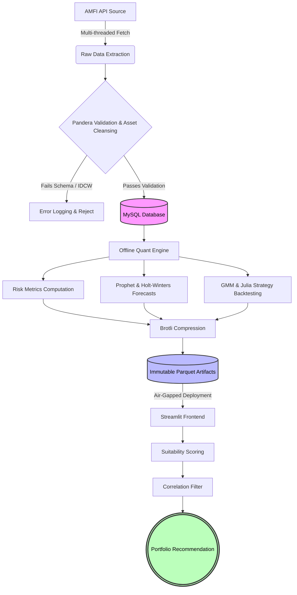
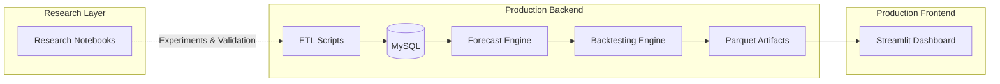

# Quantitative Mutual Fund Analytics & Forecasting Pipeline

[](https://quant-sip-engine.streamlit.app/)

An end-to-end quantitative research and deployment pipeline engineered for the Indian Mutual Fund ecosystem, combining institutional-style analytics, machine learning forecasting, systematic portfolio construction, and production-aware software engineering.

---

## Executive Summary

This repository houses an automated data pipeline and quantitative screening engine designed specifically for the Indian Mutual Fund market.

Unlike conventional dashboards that merely visualize historical returns, this system performs:

- Historical NAV ingestion at scale,
- Schema-driven data validation,
- Risk-adjusted performance analysis,
- Forecast generation using statistical and machine learning approaches,
- Portfolio construction using diversification constraints,
- Offline batch computation,
- Lightweight cloud deployment through immutable artifacts.

The objective is to support systematic and emotionless decision-making while maintaining deployment efficiency under constrained cloud environments.

The architecture adopts an **air-gapped design philosophy**, separating computationally expensive quantitative research workloads from the frontend inference layer.

Heavy processes such as forecasting, backtesting, and artifact generation are executed locally, while the deployed Streamlit application functions exclusively as a lightweight presentation layer consuming precomputed outputs.

---

## Why This Project Exists

Most publicly available mutual fund tools answer questions such as:

> "Which fund performed best historically?"

Very few attempt to answer:

> Can an entire quantitative workflow be automated—from raw NAV ingestion to portfolio recommendations—while remaining reproducible, deployment-friendly, and computationally rigorous?

This project was built to bridge the gap between:

- Quantitative research,
- Financial analytics,
- Production engineering,
- Practical deployment constraints.

It represents an attempt to operationalize systematic investment research rather than simply visualize financial data.

---

## Technical Highlights

- End-to-end ETL pipeline for Indian Mutual Fund NAV data.
- Multi-threaded ingestion with retry and resilience mechanisms.
- Schema validation using Pandera.
- Automated exclusion of IDCW schemes to preserve forecasting integrity.
- MySQL persistence via SQLAlchemy ORM.
- Rolling risk-adjusted analytics across thousands of funds.
- Prophet and Holt-Winters ensemble forecasting.
- Backtesting with transaction slippage and expense ratio drag.
- Hierarchical clustering for diversification.
- Correlation-based portfolio construction.
- Air-gapped production deployment.
- Immutable Parquet artifacts compressed for efficient delivery.
- Streamlit frontend optimized through fragmented rendering.
- Clear separation between experimentation and production execution.

---

## Backtest Performance Snapshot

Evaluated over a 1200-day synthetic market environment incorporating transaction slippage and annual expense ratio drag.

| Metric | Strategy Performance | Benchmark (Buy & Hold) |
|----------|----------------------|--------------------------|
| Directional Accuracy | 52.3% | N/A |
| Total Return | **185.4%** | 162.1% |
| Maximum Drawdown | -12.4% | N/A |
| Annualized Sharpe Ratio | 1.85 | N/A |

> **Note:** These results originate from historical simulations and are intended solely to demonstrate methodology. They do not imply future investment outcomes.

---


---

## Table of Contents

1. [System Workflow](#system-workflow)
2. [Production vs Research Architecture](#production-vs-research-architecture)
3. [Architecture & Technological Infrastructure](#architecture--technological-infrastructure)
4. [Execution Architecture & Environments](#execution-architecture--environments)
5. [Engineering Benchmarks](#engineering-benchmarks)
6. [Quantitative Backtesting & Mathematics](#quantitative-backtesting--mathematics)
7. [Statistical Characteristics of the Dataset](#statistical-characteristics-of-the-dataset)
8. [Forecasting Methodology](#forecasting-methodology)
9. [Portfolio Construction Logic](#portfolio-construction-logic)
10. [Engineering Design Principles](#engineering-design-principles)
11. [Research Notebooks](#research-notebooks)
12. [System Directory Structure](#system-directory-structure)
13. [Reproducibility & Setup](#reproducibility--setup)
14. [Execution Pathways](#execution-pathways)
15. [Future Improvements](#future-improvements)
16. [Disclaimer](#disclaimer)

---

# System Workflow



---

# Production vs Research Architecture

One of the primary design goals was to separate experimentation from production execution.

The notebooks included in this repository support exploration and reproducibility, while the deployed system relies entirely on scripted pipelines.



---

# Architecture & Technological Infrastructure

The project prioritizes deterministic reliability and data integrity before statistical inference is allowed to occur.

Each stage of the pipeline is deliberately isolated to reduce hidden dependencies and improve reproducibility.

## 1. Data Ingestion & Pipeline

Historical NAV data is extracted directly from the AMFI ecosystem using multi-threaded ingestion routines.

Since upstream financial APIs are vulnerable to:

- rate limiting,
- intermittent failures,
- incomplete responses,

the ingestion layer incorporates:

- localized retry logic,
- exponential backoff,
- continuation safeguards,

to preserve uninterrupted time series histories.

---

## 2. Data Validation & Asset Cleansing

Schema enforcement is performed using **Pandera**.

Invalid observations are quarantined prior to persistence.

Examples include:

- negative NAV values,
- missing scheme identifiers,
- malformed timestamps,
- incomplete records.

Additionally, IDCW schemes are excluded during extraction.

Dividend payouts introduce abrupt discontinuities that forecasting models may interpret as structural crashes.

Restricting training data to Growth schemes improves signal quality and preserves mathematical consistency.

---

## 3. Storage Layer

Validated observations are persisted through a MySQL relational database managed using SQLAlchemy ORM.

This layer provides:

- ACID-compliant persistence,
- efficient indexing,
- structured time series retrieval,
- connection pooling support,
- scalable querying without excessive memory consumption.

**Core Table: `nav_history`**
| Column | Type | Constraints |
|--------|------|-------------|
| `date` | DATE | Primary Key |
| `scheme_id` | INT | Primary Key, Indexed |
| `nav` | FLOAT | `> 0`, Non-Null |
---

## 4. Analytical Engine

The analytical layer computes institutional-style metrics across thousands of mutual funds.

These include:

- Compound Annual Growth Rate (CAGR),
- Rolling returns,
- Annualized volatility,
- Sharpe ratios,
- Cross-sectional rankings,
- Forecast-enhanced scoring metrics.

The resulting statistics establish a normalized framework for evaluating relative fund quality.

---

## 5. Interactive Frontend

The deployed Streamlit application operates as a lightweight presentation layer.

UI responsiveness is enhanced using fragmented rendering strategies to isolate expensive reruns.

Instead of recomputing quantitative models on demand, the frontend consumes pre-generated artifacts and focuses exclusively on:

- visualization,
- filtering,
- recommendation presentation,
- interactive exploration.

This separation minimizes deployment overhead while maintaining an interactive user experience.

---
| Component | Environment | Dependencies | Purpose |
|------------|-------------|--------------|-----------|
| `src/` | Local Batch Environment | `requirements_local.txt` | Core quantitative logic and analytical functions |
| `scripts/` | Local Batch Environment | `requirements_local.txt` | ETL orchestration, forecasting, artifact generation, and backtesting |
| `app/` | Cloud Frontend | `requirements.txt` | Lightweight Streamlit presentation layer |
| `data/` | Cloud Consumption | N/A | Immutable compressed artifacts consumed by the UI |


This separation ensures that computationally intensive routines never become bottlenecks for the deployed application.

Machine learning training and historical simulations are executed offline, while the production frontend performs only lightweight inference and rendering.

---

# Execution Architecture & Environments

To prevent heavy quantitative workloads from degrading frontend responsiveness, execution responsibilities are intentionally separated.

- **Local Research & Backend Environment:** Executes all heavy machine learning (Prophet/Holt-Winters), Julia-accelerated GMM backtesting, Monte Carlo stochastic simulations, and deep statistical computations. Outputs are strictly saved as Brotli-compressed Parquet artifacts.
- **Cloud Deployment Layer (Streamlit):** Entirely stateless and air-gapped. Consumes only the pre-computed Parquet outputs via cached functions and relies on `@st.fragment` routing to deliver sub-second interactivity for portfolio construction and visualizations without re-triggering heavy background mathematics.

---

# Engineering Benchmarks

The following benchmarks were observed during development and deployment.

These measurements are intended to provide operational context rather than universal guarantees.

## Development Environment

- CPU: Intel Core i5-12450H
- RAM: 16 GB
- Python: 3.10+
- Database: MySQL
- Deployment: Streamlit Cloud (Free Tier)

---

## Observed Operational Characteristics

| Metric | Observed Value |
|----------|----------------|
| Dashboard Interaction Latency | ~0.7–1.2 seconds |
| Streamlit Memory Footprint | ~350–450 MB |
| Brotli Artifact Size Reduction | ~78% |
| Frontend ML Training | None |
| Heavy Compute Execution | Offline Only |

> These values may vary depending on hardware specifications, deployment environments, and dataset sizes.

---

# Quantitative Backtesting & Mathematics

The system implements a systematic backtesting engine designed to evaluate a dual-factor investment framework.

The objective is not to maximize trade frequency but to prioritize signal quality and capital preservation.

---

## Signal Generation: The Dual-Factor Model

Portfolio entry requires simultaneous agreement between two independent conditions.

A position is initiated only when both conditions indicate favorable market characteristics.

---

## 1. Trend Component (EMA Crossover)

The trend module utilizes Fast and Slow Exponential Moving Averages.

Parameters:

- Fast EMA: 20 days
- Slow EMA: 50 days

A bullish environment is identified when the Fast EMA exceeds the Slow EMA.

The Exponential Moving Average is defined as:

$$
EMA_t
=
\left(
V_t
\times
\frac{2}{s+1}
\right)
+
EMA_{t-1}
\left(
1-\frac{2}{s+1}
\right)
$$

Where:

- $V_t$ = Current NAV
- $s$ = Window length
- $EMA_{t-1}$ = Previous EMA estimate

---

## 2. Unsupervised GMM Conviction Filter & Fractional Allocation

Instead of binary buy/sell flags, the system utilizes an Unsupervised Gaussian Mixture Model (GMM) to identify underlying market regimes.
The GMM continuously processes asymmetric directional volatility (upside vs. downside semi-deviation) to extract soft, continuous probabilities of being in a "crash state".

These probabilities are passed to a high-performance Julia backend (`FastCompute.jl`), which dynamically scales capital allocation:
- **Structural Uptrend:** Floor allocation is capped to prevent severe cash drag (e.g., minimum 75% market exposure regardless of minor GMM spikes).
- **Structural Downtrend/Neutral:** Full probability-based scaling allows exposure to drop to 0% to preserve capital.

Conceptually:
```text
EMA Base Trend Signal
×
(1.0 - GMM Crash Probability)
=
Dynamic Fractional Portfolio Exposure
```
---

# Risk & Performance Evaluation

Backtests compare the systematic strategy against a passive buy-and-hold benchmark.

The simulation incorporates practical frictions often ignored in academic demonstrations.

These include:

- transaction slippage,
- expense ratio drag,
- signal transition costs.

---

## Maximum Drawdown (MDD)

Maximum Drawdown estimates the largest peak-to-trough decline experienced during the investment horizon.

It provides a realistic representation of downside exposure.

$$
MDD
=
\min
\left(
\frac{V_t-P_t}{P_t}
\right)
$$

Where:

- $V_t$ = Current portfolio value
- $P_t$ = Historical peak value

Lower drawdowns generally indicate stronger capital preservation.

---

## Annualized Sharpe Ratio

The Sharpe Ratio evaluates the quality of returns after accounting for volatility.

Returns are annualized using a 252-trading-day convention.

$$
Sharpe
=
\frac{R_p-R_f}{\sigma_p}
\times
\sqrt{252}
$$

Where:

- $R_p$ = Portfolio return
- $R_f$ = Risk-free return
- $\sigma_p$ = Portfolio volatility

Higher values indicate more efficient risk-adjusted performance.

---

# Statistical Characteristics of the Dataset

Before forecasting and portfolio construction occur, the system performs exploratory statistical analysis across the mutual fund universe.

This stage validates assumptions and generates features used throughout downstream analytics.

---

## Return Distribution Analysis

Daily log returns are calculated to normalize compounding effects.

$$
r_t
=
\ln
\left(
\frac{NAV_t}{NAV_{t-1}}
\right)
$$

Where:

- $NAV_t$ = Current NAV
- $NAV_{t-1}$ = Previous NAV

Log returns offer several advantages:

- additive aggregation,
- improved comparability,
- reduced scale dependence,
- variance stabilization.

---

## Volatility Estimation

Daily volatility is transformed into annualized volatility using the trading-day convention.

$$
\sigma_{annual}
=
\sigma_{daily}
\sqrt{252}
$$

Annualization enables comparison across varying investment horizons.

---

## Correlation Structure

Diversification decisions rely on pairwise return relationships.

The system computes dynamic correlation matrices across candidate funds.

$$
\rho_{ij}
=
\frac{Cov(r_i,r_j)}
{\sigma_i\sigma_j}
$$

Where:

- $Cov(r_i,r_j)$ = Covariance between assets,
- $\sigma_i$ = Volatility of asset $i$,
- $\sigma_j$ = Volatility of asset $j$.

These matrices form the mathematical foundation for clustering and portfolio construction.

---

## Cross-Sectional Screening & Bias Mitigation

Candidate funds are ranked across multiple dimensions.

Examples include:

- CAGR,
- Volatility,
- Sharpe Ratio,
- Forecasted Growth,
- Suitability Scores.

To reduce survivorship bias, historical observations are preserved regardless of recent underperformance.

This minimizes distortions arising from evaluating only currently successful funds.

---

# Forecasting Methodology

Forward projections are generated using a dual-model ensemble designed to balance responsiveness and stability.

The two forecasting approaches capture complementary characteristics of financial time series.

---

## Facebook Prophet

Prophet is utilized for its flexibility in handling complex temporal patterns.

The model provides:

- automatic changepoint detection,
- robustness to missing observations,
- trend decomposition,
- seasonality modelling,
- resistance to moderate outliers.

Within this system, Prophet functions as the primary machine learning forecasting component.

---

## Holt-Winters Exponential Smoothing

Holt-Winters operates in parallel to capture recurring seasonal structures.

The approach models:

- level,
- trend,
- seasonality,

through recursive exponential updates.

Its inclusion introduces stability when longer periodic effects dominate recent movements.

---

## Ensemble Forecasting

The final projected NAV estimate is generated through a weighted combination of both models.

Benefits include:

- reduced forecast variance,
- improved robustness,
- lower dependence on individual model assumptions,
- enhanced stability across varying market conditions.

---

## Forecast Visualization

Forecast outputs are rendered using Plotly.

The visual design intentionally mirrors the traditional Prophet presentation style while maintaining interactivity.

Displayed elements include:

- historical observations,
- projected trajectories,
- uncertainty intervals,
- interactive exploration capabilities.

---
# Portfolio Construction Logic

The recommendation engine prioritizes diversification efficiency rather than naive allocation heuristics.

Instead of selecting the top-performing funds in isolation, the system attempts to construct portfolios that balance expected performance with redundancy minimization.

---

## Portfolio Generation Process

### Step 1: Suitability Scoring

Candidate funds are assigned dynamic suitability scores derived from risk-adjusted characteristics and investor preferences.

Inputs may include:

- Investment horizon,
- Risk tolerance,
- Historical CAGR,
- Volatility,
- Sharpe Ratio,
- Forecasted growth estimates.

The resulting scores establish an ordered ranking of eligible funds.

---

### Step 2: Anchor Fund Selection

The highest-ranked candidate becomes the portfolio's foundational component.

This fund acts as the initial allocation anchor.

```
Candidate Universe
↓
Suitability Ranking
↓
Highest Ranked Fund
↓
Anchor Selection
```

---

### Step 3: Iterative Expansion

Additional candidates are evaluated sequentially.

Rather than blindly selecting the next highest-scoring funds, each candidate undergoes diversification checks against the existing portfolio.

---

## Diversification Firewall

A correlation threshold is enforced to minimize overlapping exposures.

Funds exhibiting excessive similarity to current holdings are automatically rejected.

Threshold:

$$
\rho > 0.85
\Rightarrow
Reject
$$

This constraint attempts to eliminate redundant beta exposure.

---

## Hierarchical Clustering

Portfolio diversification is supported through Agglomerative Hierarchical Clustering using Ward's linkage criterion.

Benefits include:

- identification of structurally similar funds,
- reduction of concentration risk,
- improved diversification efficiency,
- preservation of cross-sectional opportunities.

---

## Final Portfolio Output

The recommendation engine produces a compact portfolio designed to balance:

- expected return,
- diversification,
- forecast quality,
- risk-adjusted efficiency.

Under the current implementation, the target portfolio size is:

> **Three complementary mutual funds.**

---

# Engineering Design Principles

The system was designed around three objectives:

1. Quantitative rigor,
2. Deployment practicality,
3. Reproducibility.

---

## 1. Uncompromised Computational Rigor

The pipeline intentionally rejects the practice of truncating analyses to satisfy synchronous frontend constraints.

Instead:

- forecasting executes offline,
- simulations operate on the full eligible universe,
- artifacts are generated prior to deployment.

This design favors completeness over convenience.

---

## 2. Stateless Air-Gapped Presentation Layer

The Streamlit application functions exclusively as a presentation terminal.

Its responsibilities include:

- loading artifacts,
- visual rendering,
- user interaction,
- recommendation delivery.

Heavy computation is intentionally excluded.

This separation substantially reduces the likelihood of deployment instability arising from memory limitations.

---

## 3. Strict Data Governance & Immutability

Repository hygiene is enforced through controlled artifact promotion.

Key principles include:

- exclusion of raw dataset expansions,
- immutable production artifacts,
- lightweight Git transport,
- reproducible outputs,
- controlled deployment payloads.

---

## 4. Hybrid Resilience

The deployed application incorporates graceful degradation mechanisms.

In the event of missing artifacts or synchronization failures:

- exceptions are intercepted,
- localized fallback computations are executed,
- catastrophic application crashes are avoided.

Examples include:

- targeted correlation reconstruction,
- lightweight recalculations,
- selective regeneration of analytical outputs.

This approach prioritizes continuity of service.

---

# Research Notebooks

The notebooks included within this repository are intentionally separated from the production execution path.

They exist solely to support:

- exploratory data analysis,
- hypothesis testing,
- model experimentation,
- reproducibility of reported findings,
- visual diagnostics.

They are **not** invoked by the deployed application.

This distinction reflects a deliberate separation between:

> research code and production systems.

---

# System Directory Structure

```text
mf-quant-pipeline/
├── app/
│   └── app.py
│
├── scripts/
│   ├── Back_testing.py
│   ├── build_full_history_optimized.py
│   ├── generate_backtests.py
│   ├── generate_forecasts.py
│   ├── run_backtest.py
│   ├── run_local_pipeline.py
│   ├── shrink_data.py
│   ├── simulate_risk.py
│   ├── update_daily.py
│   └── varify_data.py
│
├── src/
│   ├── analysis.py
│   ├── compute.jl
│   ├── config.py
│   ├── data_extractor.py
│   ├── db_loader.py
│   ├── features.py
│   ├── models.py
│   └── recommendations.py
│
├── notebooks/
│   ├── SIP-Analyser.ipynb
│   ├── data_inspection.ipynb
│   └── forecasting_final.ipynb
│
├── data/
│   └── production_artifacts/
│
├── requirements_local.txt
├── requirements.txt
├── .gitignore
├── .env.example
└── README.md
```

---

# Reproducibility & Setup

## Prerequisites

- Python 3.10+
- Julia 1.9+ (Required for FastCompute backend)
- MySQL Server 8.0+
- Git

---

## Clone Repository

```bash
git clone https://github.com/aneek00/financial-data-pipeline-and-quantitative-investment-analytics-engine.git

cd financial-data-pipeline-and-quantitative-investment-analytics-engine
```

---

## Install Local Quantitative Environment

Required for:

- ETL,
- forecasting,
- backtesting,
- artifact generation.

```bash
pip install -r requirements_local.txt
```

---
### Initialize Julia Backend
The quantitative engine requires the Julia bridge to be compiled on the first run.
Open a Python shell and initialize the Julia environment:
```python
import julia
julia.install()
```
---

## Environment Configuration

Create a `.env` file in the project root.

```env
DB_USER=your_user
DB_PASSWORD=your_password
DB_HOST=localhost
DB_PORT=3306
DB_NAME=mutual_funds
```

---

# Execution Pathways

## Option 1: Full System Initialization

Build the database from scratch and regenerate all production artifacts.

```bash
python scripts/run_local_pipeline.py --full
```

This workflow performs:

- historical ingestion,
- validation,
- database population,
- forecasting,
- backtesting,
- artifact generation.

---

## Option 2: Incremental Daily Update

Update the system using the latest available NAV observations.

```bash
python scripts/run_local_pipeline.py
```

This workflow performs:

- delta ingestion,
- database synchronization,
- artifact refresh.

---

To automate this, add the following cron job to execute at 11:30 PM IST daily (after AMFI updates). 
*(Note: You must replace the generic `/path/to/` placeholders with your server's absolute paths to both the Python binary and the project directory).*
```bash
30 23 * * * /path/to/venv/bin/python /path/to/mf-quant-pipeline/scripts/update_daily.py >> /var/log/mf_pipeline.log 2>&1
```

---

## Option 3: Launch Local Dashboard

Install lightweight frontend dependencies.

```bash
pip install -r requirements.txt
```

Launch Streamlit locally.

```bash
streamlit run app/app.py
```

This environment mirrors the production presentation layer without invoking heavy research computations.

---

# Future Improvements

Potential extensions include:

- rolling forecast error monitoring,
- automated model retraining policies,
- model registry integration,
- CI/CD validation pipelines,
- drift detection frameworks,
- enhanced portfolio optimization techniques.

These capabilities were intentionally excluded from the current implementation to maintain architectural simplicity and focus.

---

# Disclaimer

This repository is intended exclusively for:

- educational purposes,
- quantitative research,
- portfolio demonstration.

It does **not** constitute financial advice.

Past performance does not guarantee future results.

All investment decisions should be undertaken independently and, where appropriate, in consultation with licensed financial professionals.

---

## Closing Remarks

This project represents an effort to bridge the disciplines of:

- quantitative finance,
- machine learning,
- data engineering,
- software deployment.

It emphasizes an often-overlooked principle in portfolio projects:

> Building a model is only one part of the problem. Designing systems that validate data, survive deployment constraints, remain reproducible, and deliver usable outputs is equally important.
