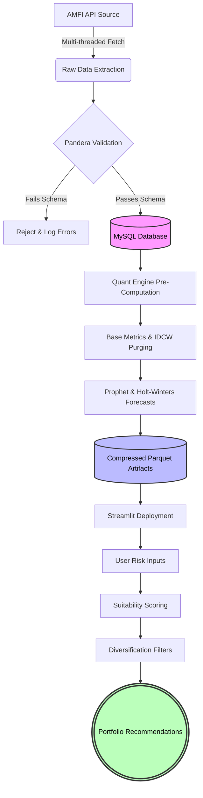

# Quantitative Mutual Fund Analytics & Forecasting Pipeline

<div align="center">

## Institutional-Grade Mutual Fund Analytics for the Indian Market

*An end-to-end quantitative research, forecasting, and portfolio construction framework engineered specifically for Indian Mutual Funds.*


</div>

---

## Overview

An automated, end-to-end quantitative screening and forecasting engine engineered specifically for the Indian Mutual Fund ecosystem.

Unlike conventional dashboards that focus primarily on visualization, this system emphasizes:

- Data integrity before inference.
- Institutional-grade risk analytics.
- Reproducible quantitative research.
- Systematic portfolio construction.
- Full-universe evaluation.
- Scalable deployment practices.

The objective is straightforward:

> Replace emotional investment decisions with transparent, reproducible, and statistically grounded processes.

---

## Why This Project Exists

Retail investors often struggle with:

- Thousands of mutual fund choices.
- Recommendations based solely on historical returns.
- Poor diversification practices.
- Black-box forecasts lacking transparency.
- Decisions influenced heavily by recency bias.

This project attempts to address these issues through a structured analytical pipeline capable of:

- Aggregating decades of NAV history,
- Validating incoming observations,
- Forecasting future trajectories,
- Measuring risk-adjusted performance,
- Constructing diversified portfolios.

---

## Key Objectives

The system attempts to answer five fundamental questions:

### 1. Which funds consistently generate superior risk-adjusted returns?

Not merely high returns, but returns that justify the level of risk undertaken.

---

### 2. Which funds survive multiple market regimes?

Performance is evaluated across varying market conditions rather than isolated periods.

---

### 3. Which funds complement each other?

Portfolio construction prioritizes diversification rather than stacking highly correlated winners.

---

### 4. Can forecasting improve allocation decisions?

Forecasts are incorporated as one component of the decision-making process rather than treated as certainty.

---

### 5. Can the entire process be automated?

Every major step is designed to be reproducible, scalable, and repeatable.

---

## Key Features

### Data Engineering

- Multi-threaded NAV extraction from AMFI.
- Incremental update mechanisms.
- Exponential backoff retries.
- Localized failure recovery.
- Continuous historical preservation.

### Data Quality Assurance

- Schema validation using Pandera.
- Corruption detection.
- Duplicate filtering.
- Timestamp anomaly checks.
- Automatic quarantine of invalid observations.

### Quantitative Analytics

- CAGR computation.
- Annualized volatility estimation.
- Sharpe ratio analysis.
- Dynamic suitability scoring.
- Correlation-based diversification.

### Forecasting

- Facebook Prophet forecasting.
- Holt-Winters Exponential Smoothing.
- Ensemble projections.
- Structural trend adaptation.
- Seasonal decomposition.

### Portfolio Construction

- Hierarchical clustering.
- Correlation firewalls.
- Risk-aware fund selection.
- Anchor fund methodology.
- Multi-factor ranking systems.

### Production Engineering

- Air-gapped deployment architecture.
- Artifact-driven frontend rendering.
- Offline heavy computation.
- Stateless dashboard delivery.
- Fail-safe fallback mechanisms.

---

## High-Level Architecture

```text
                ┌───────────────────┐
                │    AMFI Source    │
                └─────────┬─────────┘
                          │
                          ▼
                ┌───────────────────┐
                │ Multi-threaded ETL│
                └─────────┬─────────┘
                          │
                          ▼
                ┌───────────────────┐
                │ Pandera Validation│
                └─────────┬─────────┘
                          │
                          ▼
                ┌───────────────────┐
                │   MySQL Storage   │
                └─────────┬─────────┘
                          │
                          ▼
                ┌───────────────────┐
                │ Quant Engine      │
                └─────────┬─────────┘
                          │
                          ▼
                ┌───────────────────┐
                │ Forecast Models   │
                └─────────┬─────────┘
                          │
                          ▼
                ┌───────────────────┐
                │ Parquet Artifacts │
                └─────────┬─────────┘
                          │
                          ▼
                ┌───────────────────┐
                │ Streamlit Frontend│
                └─────────┬─────────┘
                          │
                          ▼
                ┌───────────────────┐
                │    End Users      │
                └───────────────────┘
```

---

## End-to-End Workflow



---

## Guiding Principles

The architecture is intentionally built around the following principles:

- Validate before modeling.
- Forecast cautiously.
- Diversify intentionally.
- Favor reproducibility over convenience.
- Prefer analytical rigor over superficial speed.

---

## Repository Structure

```text
mf-quant-pipeline/
│
├── app/                     # Streamlit presentation layer
├── data/                    # Immutable deployment artifacts
├── notebooks/               # Research and reproducibility
├── scripts/                 # Pipeline orchestration
├── src/                     # Core analytical logic
├── requirements.txt
├── requirements-local.txt
└── README.md
```

> **Important:** The notebooks included in this repository are intended exclusively for reproducibility, experimentation, and validation. They are **not part of the production execution path**.

---

## Table of Contents

- [Repository Interaction Map](#repository-interaction-map)
- [Production Execution Flow](#production-execution-flow)
- [Repository Execution Architecture](#repository-execution-architecture)
- [Research vs Production Separation](#research-vs-production-separation)
- [Data Ingestion & Pipeline](#data-ingestion--pipeline)
- [Data Validation & Asset Cleansing](#data-validation--asset-cleansing)
- [Storage Layer](#storage-layer)
- [Analytical Engine](#analytical-engine)
- [Backtesting Framework](#backtesting-framework)
- [Forecasting Methodology](#forecasting-methodology)
- [Portfolio Construction Logic](#portfolio-construction-logic)
- [Engineering Design Principles](#engineering-design-principles)
- [Reproducibility & Setup](#reproducibility--setup)
- [Disclaimer](#disclaimer)
