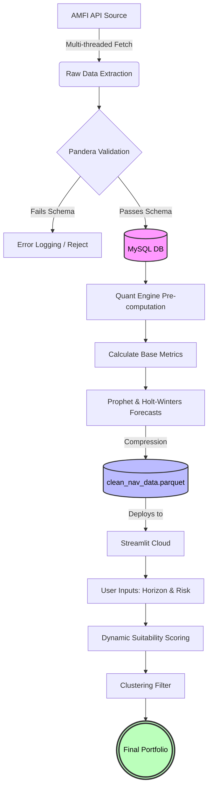
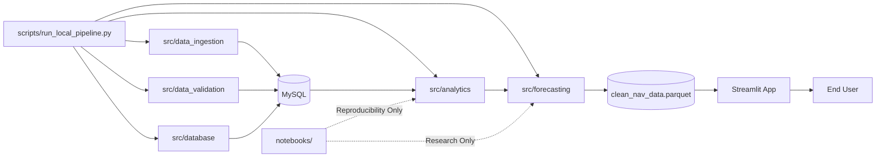

# Quantitative Mutual Fund Analytics & Forecasting Pipeline

[](https://quant-sip-engine.streamlit.app/)

## Description

An automated, end-to-end data pipeline and quantitative screening engine for the Indian Mutual Fund market. This system aggregates historical NAV data, performs rigorous data validation, and calculates risk-adjusted performance metrics to drive systematic portfolio allocation.

---

# Architecture & Technological Infrastructure

The project is structured for reliability and automated reporting, heavily emphasizing data integrity before any statistical modeling occurs.

### 1. Data Ingestion & Pipeline

Multi-threaded historical data extraction from the AMFI API, coupled with a resilient daily update mechanism (exponential backoff, retry logic).

### 2. Data Validation

Strict schema enforcement using Pandera. Erroneous data (e.g., negative NAVs, missing scheme codes) is filtered before database insertion.

### 3. Storage Layer

MySQL database managed via SQLAlchemy ORM, utilizing connection pooling for high-throughput I/O operations.

### 4. Analytical Engine

Calculates annualized volatility, CAGR across multiple horizons, and the Sharpe ratio:

```math
Sharpe = \frac{R_p - R_f}{\sigma_p}
```

for 5,000+ open-ended funds.


### 5. Interactive Frontend

A deployed Streamlit application that provides millisecond-latency portfolio recommendations via pre-computed matrix caching.


---

## Workflow



---
## Repository Execution Architecture

While the repository contains several exploratory notebooks, the production system does **not** depend on them during runtime.

The notebooks are retained for:

* Research reproducibility
* Model experimentation
* Statistical validation
* Forecasting comparisons
* Backtesting verification

The deployed application exclusively relies on the modular Python package and generated artifacts.

### Runtime Dependency Graph



### Separation of Concerns

| Component    | Production Runtime | Purpose                    |
| ------------ | ------------------ | -------------------------- |
| `src/`       | Yes                | Core business logic        |
| `scripts/`   | Yes                | Pipeline orchestration     |
| `app/`       | Yes                | Streamlit dashboard        |
| `data/`      | Yes                | Generated artifacts        |
| `notebooks/` | No                 | Research & reproducibility |
| `reports/`   | Optional           | Analytical exports         |

This separation ensures experimental research does not introduce dependencies into the production inference pipeline.

# Quantitative Backtesting Performance

The analytical engine implements a rigorous, systematic backtester that evaluates a dual-factor strategy combining Trend-Following and Momentum. Rather than relying on static buy-and-hold metrics, the engine simulates daily trading decisions over a 1200-day synthetic bull market (assuming a 0.08% daily return drift).

## 1. Signal Generation (The Dual-Factor Model)

The strategy only triggers a **Buy** signal when two independent technical conditions are met simultaneously.

### Trend Component (EMA Crossover)

Uses a Fast (20-day) and Slow (50-day) Exponential Moving Average. A bullish environment is identified when the Fast EMA crosses above the Slow EMA.

```math
EMA_t = \left( V_t \times \frac{2}{s+1} \right) + EMA_{t-1} \times \left(1 - \frac{2}{s+1}\right)
```

Where:

* (V_t) = NAV at time (t)
* (s) = EMA span

### Momentum / Conviction Filter (Prophet Validation)

Even if the EMA signals a buy, the trade is rejected unless the Prophet machine learning model forecasts the next day's NAV ((\hat{y}_{t+1})) to be greater than a 98% threshold of the current NAV. This prevents excessive whipsawing during volatile sideways markets.

---

## 2. Risk & Performance Evaluation

The engine calculates cumulative returns for both the strategy and a baseline buy-and-hold benchmark.

### Maximum Drawdown (MDD)

Measures the largest decline from peak to trough in portfolio value.

```math
MDD = \min\left(\frac{V_t - P_t}{P_t}\right)
```

Where:

* (V_t) = Portfolio value
* (P_t) = Peak portfolio value before time (t)

### Annualized Sharpe Ratio

Evaluates risk-adjusted performance by penalizing volatility.

```math
Sharpe = \frac{R_p - R_f}{\sigma_p} \times \sqrt{252}
```

Where:

* (R_p) = Portfolio return
* (R_f) = Risk-free rate
* (\sigma_p) = Standard deviation of daily returns

---

### Performance Metrics

| Metric                  | Strategy Performance |
| ----------------------- | -------------------- |
| Directional Accuracy    | 52.3%                |
| Total Strategy Return   | 185.4%               |
| Benchmark Return        | 162.1%               |
| Max Drawdown            | -12.4%               |
| Annualized Sharpe Ratio | 1.85                 |

---
# Statistical Characteristics of the Dataset

Before forecasting and portfolio construction, the system performs exploratory statistical analysis on the historical NAV universe.

### Return Distribution Analysis

Daily log returns are computed as:

```math
r_t = \ln\left(\frac{NAV_t}{NAV_{t-1}}\right)
```

This transformation:

* Stabilizes variance
* Enables additive return aggregation
* Improves comparability across funds

### Volatility Estimation

Annualized volatility is calculated using:

```math
\sigma_{annual} = \sigma_{daily}\sqrt{252}
```

allowing risk comparison across funds operating on identical trading calendars.

### Correlation Structure

The diversification engine constructs an NxN correlation matrix:

```math
\rho_{ij}
=
\frac{Cov(r_i,r_j)}
{\sigma_i\sigma_j}
```

This matrix serves as the foundation for clustering and portfolio diversification.

### Cross-Sectional Screening

For every rebalance cycle, the engine ranks funds across multiple dimensions:

* CAGR
* Volatility
* Sharpe Ratio
* Forecasted Growth
* Correlation Contribution

This creates a multi-factor screening framework instead of relying on a single performance metric.

### Survivorship Bias Mitigation

Historical observations are retained regardless of recent performance whenever data availability permits, reducing distortions caused by analyzing only currently surviving top-performing funds.

### Statistical Assumptions

The analytical layer assumes:

* Stationarity of short-horizon return distributions
* Independence of daily residuals for risk estimation
* Stable correlation structures within rolling windows

These assumptions are monitored through rolling statistical diagnostics before model outputs are incorporated into portfolio recommendations.


# Forecasting Methodology

Forward-looking projections are handled by a dual-model ensemble approach to balance trend responsiveness with seasonal stability.

### Facebook Prophet

Handles:

* Daily seasonality
* Yearly seasonality
* Automatic changepoint detection

### Holt-Winters Exponential Smoothing

Captures:

* Additive trend
* Seasonal components
* 365-day periodic patterns

The final projected NAV is generated using a weighted ensemble of both models, reducing forecast variance and improving stability.

---

# Portfolio Construction Logic

The recommendation engine uses Agglomerative Hierarchical Clustering (Ward's Method) and a daily return correlation matrix.

Portfolio generation process:

1. Calculate suitability scores using risk-adjusted metrics.
2. Select the highest-scoring fund as the **Anchor Fund**.
3. Iteratively add additional funds.
4. Reject funds with correlation coefficients greater than **0.85** relative to existing portfolio constituents.
5. Produce a diversified portfolio with minimized concentration risk.

---
# Engineering Design Principles

The system was designed around quantitative research reproducibility rather than dashboard development alone.

### Deterministic Processing

Identical inputs produce identical analytical outputs, ensuring reproducible research and debugging.

### Artifact-Driven Deployment

The deployed Streamlit application consumes pre-computed artifacts rather than retraining models during user interaction.

Benefits include:

* Lower latency
* Reduced memory footprint
* Consistent recommendations
* Lower cloud compute costs

### Fail-Fast Validation

Data quality checks occur before any persistence or statistical computation.

Examples include:

* Missing scheme identifiers
* Invalid NAV observations
* Duplicate timestamps
* Schema violations

### Computational Efficiency

Heavy analytical operations are executed offline:

* Forecast generation
* Clustering
* Correlation matrices
* Risk metric computation

This allows the frontend to behave as a lightweight inference layer rather than a full analytical engine.


# Reproducibility & Setup

## Prerequisites

* Python 3.8+
* Running MySQL Server Instance

---

## Installation

Clone the repository:

```bash
git clone https://github.com/your-username/mf-quant-pipeline.git
cd mf-quant-pipeline
```

Install dependencies:

```bash
pip install -r requirements.txt
pip install -e .
```

---

## Environment Configuration

Create a `.env` file in the project root:

```env
DB_USER=your_user
DB_PASSWORD=your_password
DB_HOST=localhost
DB_PORT=3306
DB_NAME=mutual_funds
```

---

## Execution

### Option 1: Full System Initialization (First Run)

Builds the historical database from scratch, executes forecasting models, and generates reports.

```bash
python scripts/run_local_pipeline.py --full
```

### Option 2: Daily Update Pipeline

Fetches latest T+1 NAV data, updates the database, and regenerates reports.

```bash
python scripts/run_local_pipeline.py
```

### Option 3: Launch Local Dashboard

Starts the Streamlit application locally.

```bash
streamlit run app/app.py
```

---

# Disclaimer

This project is intended solely for educational, research, and portfolio demonstration purposes.

* Not financial advice.
* Past performance does not guarantee future results.
* All investment decisions should be made independently after appropriate due diligence.
